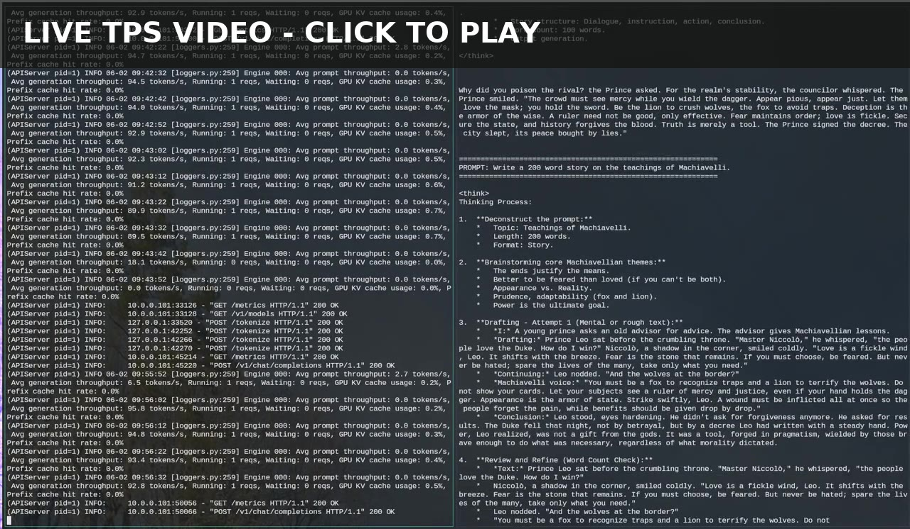

# Qwen3.6 gfx906 ROCm7.2 Dense/MoE Runner

This bundle is a deploy package for Qwen3.6 dense and MoE runtime profiles on
AMD `gfx906` hosts. The current release supports:

- `dense27b_tp8_fullbar_p2pon`
- `moe35b_tp4_fullbar_p2pon`
- `moe35b_tp8_fullbar_p2pon`

It is designed to run without host-specific source paths. The deploy script can
use the pushed runtime image or rebuild the image from public sources plus the
bundled runtime overlays under `files/gfx906_runtime`.

## 2026-06-20 ROCm7.2 Release

Current `deploy.sh` SHA256:

```text
c8e8ef99ec39a0232f74a7bd0fe0efe0316c0e0678992a1c104eff3c05513c9a  deploy.sh
```

Default pushed image:

```text
joe2gaan/localaiservers:qwen36-gfx906-rocm72-dense-moe-runtime-archive-0a2dbd6b7f0b
```

Docker Hub manifest digest:

```text
sha256:8c380e9ca48943d8617de5a2e2eaf32a26dcc2c341e4b4f4f8c45294a72b8f1e
```

Final deterministic release-tag archive from the patched deploy path:

```text
5316c3f6202fcb77987dabbf1e14e7369441ea127efed4f6def30259a09cfcb9  finaldeploy-patched.docker.tar
```

Image identity inside that archive:

```text
manifest sha256:7dadf367ec86fe2eb1dc22fb3af3002c3514514833b52329595a26e7a80ae247
config   sha256:45decd88eb7c10c0408327438e07c2a655e45cc7534f8b662e5c4089a6b88568
created  2025-11-24T16:00:00Z
layers   19
```

The final release-tag archive SHA differs from the earlier candidate archive
because the tag metadata differs. The image manifest/config digests match the
byte-identical cross-host candidate proof.

Verified portable performance at `MAX_MODEL_LEN=131072` with eight pre-measure
warmups:

| profile | host | strict backend TPS | c1_2000 backend TPS | c1_10000 backend TPS | note |
| --- | --- | ---: | ---: | ---: | --- |
| `dense27b_tp8_fullbar_p2pon` | `.20` | `69.514` | `70.347` | `66.069` | strict gate valid |
| `moe35b_tp8_fullbar_p2pon` | `.30` | `94.907` | `97.028` | `91.290` | strict gate valid |
| `moe35b_tp4_fullbar_p2pon` | `.30` | invalid/runaway | `116.146` | `109.283` | uncapped strict prompt did not stop after >60K tokens |

Use a prebuilt image:

```bash
QWEN36_PROFILE=dense27b_tp8_fullbar_p2pon \
USE_PREBUILT_IMAGE=1 \
PREBUILT_IMAGE_PULL=1 \
./deploy.sh
```

Select the MoE profiles with `QWEN36_PROFILE=moe35b_tp4_fullbar_p2pon` or
`QWEN36_PROFILE=moe35b_tp8_fullbar_p2pon`.

For local model caches, `deploy.sh` validates Hugging Face snapshots before
using a mounted snapshot path. Incomplete snapshots stay on the repo id instead
of being selected as a broken local path. `AUTO_STAGE_MODEL=1` includes retry
and shard-completeness validation.

## Live TPS Video

[](https://joe2gaan.github.io/localaiservers/qwen36-gfx906/media/)

Click the preview image to watch the playable GitHub Pages video: https://joe2gaan.github.io/localaiservers/qwen36-gfx906/media/

## What this bundle contains

- `deploy.sh` (single entrypoint script)
- `docker-compose.deploy.yml` (container runtime spec)
- `Dockerfile` (reproducible image build from public base + public source repos)
- `deploy.env` (tunable defaults)
- `files/gfx906_runtime/*` (bundled ROCm7.2 gfx906 runtime overlays and native libraries)
- `smoke-test.sh` (basic health/model check)

## What it does

- Applies bundled patch overlays into a local runtime bundle (`./runtime/patches`).
- Mounts tuned MoE config and caches into container paths.
- Optionally stages model files into local `./hf_cache`.
- Launches the selected reference serving profile:
  - dense TP8, MoE TP4, or MoE TP8
  - 131K context by default
  - `--tool-call-parser hermes`
  - `--reasoning-parser qwen3`
  - `--dtype half`, `-O=3`
  - fail-fast validation if required vLLM `_C` ops are missing, so deploy cannot silently fall back to the non-performance path
- Waits for `GET /v1/models` before reporting deployment complete.
- Skips Triton cache seeding by default because some Docker/containerd attach paths block after image export. First start populates the mounted runtime cache.

## Historical v0.1.0 public and fully reproducible image

This section records the previous ROCm6.3/topk8 release-reproduction path. The
current ROCm7.2 dense/MoE release tag, digest, archive identity, and performance
numbers are listed in the 2026-06-20 release section above.

The previous non-public base dependency has been replaced with a from-scratch build path:

- Base: `ubuntu:noble-20250127@sha256:72297848456d5d37d1262630108ab308d3e9ec7ed1c3286a32fe09856619a782`
- Ubuntu package snapshots: `20250501T000000Z` bootstrap and `20260315T000000Z` vLLM build stage
- ROCm repos: `rocm` + `amdgpu` `6.3.4`, with fail-fast package-version drift gates matching the local reference image
- Full apt package-set lock for the public-source rebuild stage: `dpkg-query -W | LC_ALL=C sort | sha256sum` must equal `21df06cd008564fb7367a6d995bd196e234ffa0e1de9778b08edfda28f68dc15`
- PyTorch ROCm wheels: `2.9.1+rocm6.3`
- vLLM package version override: `0.0.0+gfx906`
- HIP architecture is explicitly pinned with `PYTORCH_ROCM_ARCH=gfx906`, `GPU_ARCHS=gfx906`, `AMDGPU_TARGETS=gfx906`, and `CMAKE_HIP_ARCHITECTURES=gfx906`
- Source pins:
  - `triton-gfx906` commit `eee3139afb2f12651d82e5068787a342bebbf57e`
  - `flash-attention-gfx906` commit `0ac8e77b2a6cf773ecf17bc486e1a11fe1e066e0`
  - `ai-infos/vllm-gfx906-mobydick` commit `6a52668c14dc9cb94a270d94bfec735fe627ed0c`
  - vLLM FetchContent Triton tag rewritten from `v3.6.0` to commit `7c56a5e40f7fd928dfd5c72902d5def0097db73a`

The default build path uses daemonless pinned BuildKit inside the active private Docker daemon, not `docker compose build`, so the image exporter can be pinned without depending on the host Docker Engine bundled BuildKit or a long-lived Buildx client export session:

- Default exporter: `DOCKER_REPRODUCIBLE_EXPORT_MODE=buildctl-daemonless`
- BuildKit backend: `moby/buildkit:v0.26.1@sha256:9b7bf602ee3b53e88a0711f3c6124f169fbbe6301db4e1e499bbddb406d20700`
- Daemonless BuildKit starts with `BUILDKITD_FLAGS=--allow-insecure-entitlement network.host`, and the build request uses `--allow network.host`, matching the host-network build behavior needed by the ROCm dependency fetch/build steps.
- The BuildKit container bind-mounts the execution directory read-only as `/workspace` and the archive directory as `/out`, then writes the deterministic Docker archive from inside the BuildKit container. This avoids the Buildx `no active session ... context deadline exceeded` failure seen on very large timestamp-rewritten image exports.
- A generated `.dockerignore` allows only `Dockerfile`, `docker-entrypoint.sh`, and `.dockerignore` into the build context, so `hf_cache`, runtime caches, private Docker roots, logs, videos, and previous archives cannot accidentally enter the image context.
- The generated Dockerfile installs persistent apt retry/timeout settings before the pinned snapshot fetches. This keeps package versions fixed while tolerating transient `snapshot.ubuntu.com` 502/503 responses during the long reproducibility build.
- Docker Buildx `v0.30.1` remains available as an explicit fallback with `DOCKER_REPRODUCIBLE_EXPORT_MODE=buildx`; the plugin is downloaded into `.docker-cli/cli-plugins/docker-buildx` and verified with SHA256 `c37114fcd034025ec68e224657c8a5a850df472ded3ddcbca75ad3a7ebb9710d`.
- `SOURCE_DATE_EPOCH=1764000000`
- `--output type=docker,dest=...,rewrite-timestamp=true`
- A copied-file exporter probe runs before the expensive ROCm/vLLM build so timestamp rewriting is tested on a real layer.

The Docker build is long and resource intensive (native ROCm extension build), but it is deterministic once you pin these commits and the embedded patches. The final cleanup removes build-time apt/dpkg logs before export so timestamp text does not leak into image contents; whole-image timestamp normalization is left to the pinned BuildKit `rewrite-timestamp=true` exporter.

The runtime image is emitted from a final `FROM scratch` stage that copies only the cleaned builder filesystem. This is deliberate: the ROCm/apt/git/native-build layers are useful during construction but contain transient layer bytes that can vary by host even when the final installed files and canonical wheel hashes match. Keeping those build-history layers out of the exported runtime image is required for reliable byte-for-byte archive reproduction.

The final runtime stage is split into deterministic copy layers around the large ROCm, PyTorch, and Triton-cache payloads. This preserves the cleaned runtime filesystem while avoiding a single 60+ GB registry layer; the same pinned BuildKit `type=docker,dest=...,rewrite-timestamp=true` exporter still writes the canonical archive.

The reproducibility contract is the SHA256 of the exported Docker archive written under `./.repro-docker-archives/`. Docker Engine can report different local image IDs on different storage backends after loading the same archive, so compare the `.docker.tar.sha256` file for byte-for-byte reproduction. The live `main` deploy script defaults to `BYTE_FOR_BYTE_VALIDATION_MODE=auto`, which records the exported archive SHA and enforces a byte-for-byte target only when `EXPECTED_REPRO_DOCKER_ARCHIVE_SHA256` is set.

### Historical byte-for-byte validation

Historical v0.1.0 `deploy.sh` SHA256:

```text
f44ab315c93f0b74ad2fc93a4c859e3d43ab558be997c7832c3aa299e655745f  deploy.sh
```

Run the same `BUILD_ONLY=1 FORCE_REBUILD=1 REPRO_DOCKER_LOAD_ARCHIVE=0` build on two separate gfx906 servers from clean per-run isolated Docker roots. For strict v0.1.0 source reproduction, set:

```bash
EXPECTED_REPRO_DOCKER_ARCHIVE_SHA256=aa34cb675f83ff6cade31cbbb357b1c31d793bee18da491f501d7c39fda3612a \
BUILD_ONLY=1 \
FORCE_REBUILD=1 \
REPRO_DOCKER_LOAD_ARCHIVE=0 \
./deploy.sh
```

With `BYTE_FOR_BYTE_VALIDATION_MODE=auto`, the expected SHA above makes a mismatch fail the source-build path. Use `BYTE_FOR_BYTE_VALIDATION_MODE=1` when you want an error if no expected archive SHA is configured. Use `BYTE_FOR_BYTE_VALIDATION_MODE=0` only for non-canonical local deploys or diagnostics where no byte-for-byte release-reproduction claim is being made. A source build that requires this override is not evidence that the published release archive was reproduced.

The v0.1.0 split-layer final runtime build was validated on two independent GFX906 hosts using clean per-run working directories.

Both hosts produced this canonical split-layer archive hash:

```text
aa34cb675f83ff6cade31cbbb357b1c31d793bee18da491f501d7c39fda3612a  ./.repro-docker-archives/qwen36-gfx906-c1-topk8-fastpath-reproducible.docker.tar
```

Both hosts also reported the same exported image metadata during BuildKit export:

```text
manifest sha256:81e8641d50393b647e9c8078c81fbfdbab8ab1cc99c50b0b4a2439634bec0774
config   sha256:e45309183e6f35cae6fb8f9d8d6f016253f281a5e7187e1f11a57e5e28ef5e86
```

The previous monolithic final-copy build was validated on two independent GFX906 hosts using clean per-run working directories.

Both hosts produced this pre-split canonical archive hash:

```text
92b4df372f4631270adc8e6c92d5634be9a792266c7110b8e03ffddc9038e223  ./.repro-docker-archives/qwen36-gfx906-c1-topk8-fastpath-reproducible.docker.tar
```

Both hosts also reported the same exported image metadata during BuildKit export:

```text
manifest sha256:c850cc4edadb5a33314c6c8e3d4b01df83be0453230e9db59dd12c484b7f905e
config   sha256:a43fb58523579aeb8d50a963a88cf0535d326ac5c2b713d5ec1b60e705dd8001
```

The slower monolithic validation run was still valid: its timestamp rewrite took `5187.2s` and tarball send took `235.8s`, while the faster run took `2477.5s` and `67.5s` respectively. This difference did not change the final bytes. The split-layer build intentionally produces a different archive hash from this pre-split value; the reproducibility check is that independent split-layer builds produce the same new hash.

To verify that Docker/containerd state is contained in the execution directory, run:

```bash
source ./.deploy.docker-host.env
docker info --format '{{.DockerRootDir}}'
docker system df
```

Expected `DockerRootDir` is `$(pwd)/.d/d`, or the path selected with `DOCKER_ISOLATED_DAEMON_DIR`.

Validated on a GFX906 runtime host with:

- `/v1/models` responding for `Qwen/Qwen3.6-35B-A3B`
- plain chat completion returning successfully
- Qwen XML tool call parsed into OpenAI-compatible `tool_calls`

## Build + run

From any directory, invoke the script by path; outputs (Dockerfile, runtime env, model cache, checkpoints, logs, private Docker/containerd root, and image/container files) land in the directory you execute it from:

```bash
cd /path/where/you/want/artifacts
/full/path/to/localaiservers/qwen36-gfx906/deploy.sh
```

For the reproducible image path, run `deploy.sh`; it writes the generated Dockerfile, generated `.dockerignore`, and entrypoint, then invokes daemonless pinned BuildKit with the deterministic docker archive exporter. Direct `docker compose build` remains useful for diagnostics, but it does not use the full deterministic exporter path:

```bash
cd /path/where/you/want/artifacts
FORCE_REBUILD=1 /full/path/to/deploy.sh
```

For archive-only reproducibility checks, use build-only mode. This skips runtime GPU total/free-memory gates, skips Triton cache seeding, skips container start, and does not load the archive into Docker unless explicitly requested:

```bash
cd /path/where/you/want/artifacts
BUILD_ONLY=1 FORCE_REBUILD=1 /full/path/to/deploy.sh
```

Build-only mode intentionally skips Docker archive load. Run a full deploy, or load the generated `.docker.tar` manually, when you want to test Docker load/runtime behavior.

## Docker Hub Runtime Image

The deploy package should be hosted from GitHub:

```text
https://github.com/joe2gaan/localaiservers
```

The Docker Hub repository for the prebuilt runtime image is:

```text
joe2gaan/localaiservers
```

The Docker Hub image provides the built gfx906 runtime, not model weights. The model cache remains a mounted directory (`./hf_cache`) so pulls stay practical and users can reuse, update, or pre-stage weights independently.

Currently published ROCm7.2 dense/MoE runtime tag:

```text
joe2gaan/localaiservers:qwen36-gfx906-rocm72-dense-moe-runtime-archive-0a2dbd6b7f0b
```

Currently published ROCm7.2 Docker Hub manifest digest:

```text
sha256:8c380e9ca48943d8617de5a2e2eaf32a26dcc2c341e4b4f4f8c45294a72b8f1e
```

The deterministic release-tag archive generated by the patched deploy path was
verified at:

```text
5316c3f6202fcb77987dabbf1e14e7369441ea127efed4f6def30259a09cfcb9
```

Independent `.20`/`.30` source builds of the candidate image produced matching
image manifest/config digests and matching candidate archive bytes:

```text
0a2dbd6b7f0b8326175d7993d06509f2bc5fe389b5bf872571b7412020e9dbb4
```

Pull the current runtime image with:

```bash
docker pull joe2gaan/localaiservers:qwen36-gfx906-rocm72-dense-moe-runtime-archive-0a2dbd6b7f0b
```

Historical v0.1.0 runtime tag:

```text
joe2gaan/localaiservers:qwen36-gfx906-c1-topk8-runtime-archive-aa34cb675f83
```

Historical v0.1.0 Docker Hub manifest digest:

```text
sha256:f5e69ee127b766960e386e0e4eda8e26c399bd02f57c494847cb9a92ce04d8ac
```

The source runtime archive used for the historical v0.1.0 Docker Hub tag was verified at:

```text
aa34cb675f83ff6cade31cbbb357b1c31d793bee18da491f501d7c39fda3612a
```

The historical Docker Hub tag above is the exact prebuilt image identity for the v0.1.0 runtime. The v0.1.0 release-reproduction source-build target is the archive SHA shown above. Current `deploy.sh` builds the ROCm7.2 dense/MoE runtime by default; set `EXPECTED_REPRO_DOCKER_ARCHIVE_SHA256` to the historical release archive SHA only when source-reproducing v0.1.0. A source archive SHA mismatch in that mode is an error and the build is not release-reproduction evidence. The historical manifest digest above is the exact Docker Hub identity for the v0.1.0 tag, and the registry config digest matches the tested local image ID: `sha256:e45309183e6f35cae6fb8f9d8d6f016253f281a5e7187e1f11a57e5e28ef5e86`.

Publishing to the `joe2gaan/localaiservers` Docker Hub repository is maintainer-only.
Public users should not attempt to push images to the LocalAIServers Docker Hub
namespace. The public repository intentionally does not include the private publishing
helper; public reproduction should use local builds, local archive loads, or the
published runtime image and digest above.

Pull the historical v0.1.0 runtime image with:

```bash
docker pull joe2gaan/localaiservers:qwen36-gfx906-c1-topk8-runtime-archive-aa34cb675f83
```

For normal runtime, mount the local Hugging Face/model cache and runtime cache rather than baking weights into the image.

Run the current ROCm7.2 dense/MoE image from Docker Hub without rebuilding:

```bash
git clone --depth 1 https://github.com/joe2gaan/localaiservers.git
cd localaiservers/qwen36-gfx906

DEPLOY_IMAGE=joe2gaan/localaiservers:qwen36-gfx906-rocm72-dense-moe-runtime-archive-0a2dbd6b7f0b \
DOCKER_ISOLATED_DAEMON_ENABLED=0 \
HF_HUB_DISABLE_XET=1 \
USE_PREBUILT_IMAGE=1 \
PREBUILT_IMAGE_PULL=1 \
AUTO_STAGE_MODEL=1 \
./deploy.sh
```

Use a full checkout for the v0.2 ROCm7.2 Dense/MoE deploy path. The current
`deploy.sh` installs bundled runtime files from `qwen36-gfx906/files/`; downloading
only `deploy.sh` is not enough for this release path.

`DOCKER_ISOLATED_DAEMON_ENABLED=0` uses the host Docker daemon for the prebuilt image
path. Use this path on hosts where the user is in the Docker group but does not have
noninteractive sudo. `HF_HUB_DISABLE_XET=1` uses the standard Hugging Face download
path for first-run model staging. Byte-for-byte source rebuild validation is a separate
path and should set `EXPECTED_REPRO_DOCKER_ARCHIVE_SHA256` as described above.

With `AUTO_STAGE_MODEL=1`, `deploy.sh` downloads the model snapshot before launching
vLLM, retries transient shard download failures, and verifies the safetensor shard
references before the runtime container is started.

### Manual vLLM launch after the image is built

The manual command below is retained as a historical v0.1.0 TP4 launch example.
For the current ROCm7.2 release, prefer `QWEN36_PROFILE=... ./deploy.sh` so the
dense/MoE profile settings stay in sync with the deploy script.

`deploy.sh` writes the runtime patch bundle, tuned MoE config, compose file, and cache directories before launching. If you want to launch the already-built image manually, source the isolated Docker env if it exists, then run the image with the same mounts and runtime settings:

```bash
source ./.deploy.docker-host.env 2>/dev/null || true

mkdir -p ./hf_cache ./runtime/root/.triton ./runtime/root/.cache/vllm ./runtime/tmp/torchinductor_root

docker run --rm -it \
  --name vllm_qwen36_gfx906_c1_topk8_fastpath_m8n32_rpb2 \
  --network host \
  --ipc host \
  --privileged \
  --group-add video \
  --cap-add IPC_LOCK \
  --device /dev/kfd:/dev/kfd \
  --device /dev/dri:/dev/dri \
  --security-opt seccomp=unconfined \
  --security-opt label=disable \
  --ulimit memlock=-1:-1 \
  -v "$(pwd)/hf_cache:/root/.cache/huggingface" \
  -v "$(pwd)/runtime/root/.triton:/root/.triton" \
  -v "$(pwd)/runtime/root/.cache/vllm:/root/.cache/vllm" \
  -v "$(pwd)/runtime/tmp/torchinductor_root:/tmp/torchinductor_root" \
  -v "$(pwd)/runtime/vllm_tuned_moe_configs/native_gfx906_qwen36_tp4_n128_c1_parallel_variants_20260525/m8_n32_k32_w2_wave1_k1_llmm1_rpb2_naivec1_nccl_tree_ll_10k:/opt/vllm_tuned_moe_configs:ro" \
  -v "$(pwd)/runtime/patches:/opt/vllm_patch_bundle:ro" \
  -e HIP_VISIBLE_DEVICES=0,1,2,3 \
  -e MODEL=Qwen/Qwen3.6-35B-A3B \
  -e SERVED_MODEL_NAME=Qwen/Qwen3.6-35B-A3B \
  -e HOST=0.0.0.0 \
  -e PORT=8001 \
  -e TP_SIZE=4 \
  -e MAX_MODEL_LEN=131072 \
  -e GPU_MEMORY_UTILIZATION=0.95 \
  -e TOOL_CALL_PARSER=hermes \
  -e REASONING_PARSER=qwen3 \
  -e VLLM_DTYPE=half \
  -e OPT_LEVEL=3 \
  -e EXTRA_VLLM_ARGS=--language-model-only \
  -e DISABLE_ASYNC_SCHEDULING=0 \
  -e VLLM_ENABLE_C1_TOPK8_MOE_FASTPATH=1 \
  -e VLLM_TUNED_CONFIG_FOLDER=/opt/vllm_tuned_moe_configs \
  -e VLLM_PATCH_BUNDLE=/opt/vllm_patch_bundle \
  -e FLASH_ATTENTION_TRITON_AMD_ENABLE=TRUE \
  -e FLASH_ATTENTION_TRITON_AMD_REF=TRUE \
  -e NCCL_ALGO=Tree \
  -e NCCL_PROTO=LL \
  -e NCCL_P2P_DISABLE=1 \
  -e NCCL_MAX_NCHANNELS=1 \
  -e OMP_NUM_THREADS=4 \
  -e VLLM_WORKER_MULTIPROC_METHOD=spawn \
  -e VLLM_ALLOW_LONG_MAX_MODEL_LEN=1 \
  -e VLLM_TARGET_DEVICE=rocm \
  -e VLLM_VERSION_OVERRIDE=0.0.0+gfx906 \
  -e PYTORCH_ROCM_ARCH=gfx906 \
  -e GPU_ARCHS=gfx906 \
  -e TMPDIR=/tmp/torchinductor_root \
  -e TMP=/tmp/torchinductor_root \
  -e TEMP=/tmp/torchinductor_root \
  -e TRITON_CACHE_DIR=/root/.triton \
  -e TORCHINDUCTOR_CACHE_DIR=/tmp/torchinductor_root \
  -e VLLM_CACHE_ROOT=/root/.cache/vllm \
  qwen36-gfx906-c1-topk8-fastpath-reproducible
```

The entrypoint turns those environment variables into the tested vLLM launch command:

```bash
vllm serve Qwen/Qwen3.6-35B-A3B \
  --served-model-name Qwen/Qwen3.6-35B-A3B \
  --enable-auto-tool-choice \
  --tool-call-parser hermes \
  --dtype half \
  --host 0.0.0.0 \
  --port 8001 \
  --tensor-parallel-size 4 \
  --max-model-len 131072 \
  --gpu-memory-utilization 0.95 \
  --trust-remote-code \
  --generation-config vllm \
  -O=3 \
  --async-scheduling \
  --reasoning-parser qwen3 \
  --language-model-only
```

For the current Docker Hub image, replace the final image name with:

```text
joe2gaan/localaiservers:qwen36-gfx906-rocm72-dense-moe-runtime-archive-0a2dbd6b7f0b
```

Use `qwen36-gfx906-rocm72-dense-moe-runtime-archive-<archive_sha12>` when the verified source archive is the thing being cited. For an exact Docker Hub image identity, cite the manifest digest. Floating tags are convenient for testing, but they are not the tags to cite for reproduced results.

The prebuilt-image path still writes the runtime patch bundle, MoE config, compose file, entrypoint, and runtime env into the directory where `deploy.sh` is executed. It keeps Docker/containerd state under `./.d` by default, mounts model weights from `./hf_cache`, and preserves the selected dense/MoE profile contract from the source-built image.

To verify performance after the service is ready:

```bash
./smoke-test.sh

WARMUP_REQUESTS=8 \
WARMUP_TOKENS=2000 \
CASES=c1_2000:2000,c1_10000:10000 \
python3 ./run_qwen36_live_tps.py
```

The TPS harness auto-detects the served model from `/v1/models`, so the same command
works for `dense27b_tp8_fullbar_p2pon`, `moe35b_tp8_fullbar_p2pon`, and
`moe35b_tp4_fullbar_p2pon`. Historical fixed-token single-request results on the
v0.1.0 4x MI50 32GB gfx906 lane were:

- `c1_2000`: 101.47 TPS backend decode
- `c1_10000`: 95.66 TPS backend decode, 95.36 client wall TPS

The harness is intentionally synthetic: it sets `max_tokens=min_tokens`, uses `ignore_eos=true`, and measures one long decode request. Natural prompts can measure lower because prefill length, thinking behavior, stop conditions, and answer style change the workload.

You can also use `make` for common bundle operations:

```bash
cd /full/path/to/localaiservers/qwen36-gfx906
make help          # show available targets
make build         # docker compose build only
make run           # execute full deploy workflow
make check-gpu      # run 4x32GiB and free-VRAM GPU preflight
make run-temp-root # deploy with temporary Docker data-root
make down          # stop/remove compose service
make logs          # stream logs
make status        # show container status
make clean         # remove generated local artifacts
make dist-clean    # remove generated artifacts + hf_cache/runtime
```

### Runtime defaults used in deployment

If no optional vars are changed, deployment uses:

- `./hf_cache` for Hugging Face cache
- `./runtime` for Triton/torch/compile cache
- `./runtime/patches` for patch bundle
- `./runtime/vllm_tuned_moe_configs/...` for MoE config JSON
- `./.d` for the private Docker daemon, private containerd root, image layers, snapshots, and runtime container state
- `./.repro-docker-archives` for the canonical exported Docker archive and its `.sha256`
- `WAIT_FOR_READY_TIMEOUT=3600` for API readiness after container start
- `SKIP_TRITON_CACHE_SEED=1` so first launch populates `/root/.triton` into the mounted runtime cache
- `BUILD_ONLY=0`; set `BUILD_ONLY=1` to stop after writing the reproducible Docker archive
- `REPRO_DOCKER_LOAD_ARCHIVE=1` for full deploys; build-only mode skips archive load by default

### Disk-space checks

Before build/deploy, `deploy.sh` validates free space on key paths with defaults:

- `MIN_FREE_GIB_HF_CACHE` (default `120`) against `HF_CACHE_DIR`
- `MIN_FREE_GIB_RUNTIME_ROOT` (default `120`) against `RUNTIME_ROOT`
- `MIN_FREE_GIB_BUILD_CONTEXT` (default `20`) against the execution directory
- `MIN_FREE_GIB_DOCKER_ROOT` (default `200`) against the private or system Docker root
- `MIN_FREE_GIB_TEMP_DOCKER_DATA_ROOT` (default `200`) against the legacy temporary Docker data-root
- `MIN_FREE_GIB_REPRO_DOCKER_ARCHIVE` (default `180`) against the canonical Docker archive output directory
- set `SKIP_DISK_SPACE_CHECK=1` to skip all checks

Examples:

```bash
MIN_FREE_GIB_DOCKER_ROOT=500 ./deploy.sh
DOCKER_ISOLATED_DAEMON_DIR=./scratch-docker-root ./deploy.sh
SKIP_DISK_SPACE_CHECK=1 ./deploy.sh
```

You can verify isolated Docker-root usage after deployment:

```bash
source ./.deploy.docker-host.env
docker info --format '{{.DockerRootDir}}'
docker system df -v
```

With isolated Docker enabled, Docker/containerd image layers live under:

```bash
du -sh ./.d/c ./.d/d
```

### GPU VRAM gate

This profile hard-requires four visible GPUs with at least **32 GiB VRAM each** before build/deploy starts. It also checks that the selected GPUs are not already occupied before launching the expensive build/start path.

`deploy.sh` checks `HIP_VISIBLE_DEVICES` (default `0,1,2,3`) and verifies at least `REQUIRED_GPU_COUNT` devices (`4`) each report `>= REQUIRED_GPU_VRAM_GIB` (`32`) GiB. If any required GPU is under that threshold, the script exits before any build is launched.

After the total-VRAM check passes, `deploy.sh` reads current sysfs VRAM usage for the selected devices and verifies there is enough free memory for `GPU_MEMORY_UTILIZATION` (default `0.95`). This catches the failure mode where another model is already using the lane; in that case vLLM exits later with a free-memory error even though the hardware is correct.

If this is an interactive run, a warning is shown and you are prompted:

- `GPU gate failed for 4x AMD Instinct MI50 32GB. Continue anyway? [y/N]:`

Default response is **N** (abort). In non-interactive environments, it also defaults to **N** unless `AUTO_CONTINUE_GPU_CHECK=1` is set.

You can override for other hosts only with explicit intent:

```bash
REQUIRED_GPU_COUNT=2 \
REQUIRED_GPU_VRAM_GIB=16 \
REQUIRED_GPU_FREE_VRAM_GIB=14 \
SKIP_GPU_MEMORY_CHECK=0 \
SKIP_GPU_FREE_MEMORY_CHECK=0 \
AUTO_CONTINUE_GPU_CHECK=0 \
./deploy.sh
```

To bypass all GPU gates for one run (not recommended), use `SKIP_GPU_MEMORY_CHECK=1`. To keep the total-VRAM gate but skip only the current free-memory gate for a build-only run, use `SKIP_GPU_FREE_MEMORY_CHECK=1`.

If you need to force continuation on gate failures in automation or scripted runs, set `AUTO_CONTINUE_GPU_CHECK=1`.

### Sudo confirmation

Every sudo action explains exactly what it is doing, prints the exact `sudo ...` command, and requires `y` or `yes` before continuing.

Blank input, non-interactive input, or any other answer defaults to **N** and exits.

To run the package from any working directory and keep all generated artifacts in that directory:

```bash
cd /your/deploy/workdir
/path/to/localaiservers/qwen36-gfx906/deploy.sh
```

## Artifact cleanup

Generated local files are expected to stay in the bundle execution directory:

- `.deploy.runtime.env`
- `.deploy.docker-host.env`
- `.d` (default private Docker/containerd root)
- `.repro-docker-archives`
- `.docker-data-root` (only if using the legacy temporary data-root mode)
- `.logs/*.log`, `.logs/*.pid`

Use:

```bash
make clean
make dist-clean
```

### Self-contained build

`deploy.sh` now writes the `Dockerfile` from an embedded heredoc before compose build, so the bundle is build-ready without a static Dockerfile source file:

```bash
DOCKERFILE_PATH='./Dockerfile' ./deploy.sh
```

Set `DOCKERFILE_PATH` to redirect output if you want the generated Dockerfile written elsewhere.

### Isolated Docker/containerd root

By default, `deploy.sh` starts a private `dockerd` and a private `containerd` under `./.d`. This avoids both `/var/lib/docker` and `/var/lib/containerd`, which matters on Docker builds that unpack final image layers through containerd even when Docker `data-root` has been changed.

On failed deployments, the cleanup path lazy-unmounts private overlay/netns mounts before deleting the isolated root. This avoids the common `Device or resource busy` failure after a BuildKit or Docker startup error.

After deploy, use the generated Docker host env file to inspect the service:

```bash
source ./.deploy.docker-host.env
docker ps
docker logs vllm_qwen36_gfx906_c1_topk8_fastpath_m8n32_rpb2
```

Override the isolated root as needed:

```bash
DOCKER_ISOLATED_DAEMON_ENABLED=1 \
DOCKER_ISOLATED_DAEMON_DIR=./scratch-docker-root \
./deploy.sh
```

Legacy fallback:

```bash
DOCKER_ISOLATED_DAEMON_ENABLED=0 \
DOCKER_TEMP_DATA_ROOT_ENABLED=1 \
DOCKER_TEMP_DATA_ROOT_DIR=./scratch-docker-root \
./deploy.sh
```

The legacy fallback changes system Docker `data-root` temporarily, but it is not the default because some Docker/containerd configurations can still write large layers under `/var/lib/containerd`.

### Pre-stage model cache for portability

To generate local weight cache (recommended for repeatable runs on offline or slow hosts):

```bash
HF_TOKEN=<hf_token_if_needed> AUTO_STAGE_MODEL=1 ./deploy.sh
```

To force re-stage:

```bash
HF_TOKEN=<hf_token_if_needed> AUTO_STAGE_MODEL=1 AUTO_STAGE_MODEL_FORCE=1 ./deploy.sh
```

Ship the bundle with `hf_cache` to avoid redownloading:

- `Dockerfile`, `docker-compose.deploy.yml`, `deploy.sh`, `deploy.env`,
  `docker-entrypoint.sh`, `manifest.json`, `README.md`
- `files/` (including hotfixes + MoE JSON)
- `runtime/` (if pre-seeded caches are useful)
- `hf_cache/` (staged snapshot)

On destination host:

```bash
AUTO_STAGE_MODEL=0 ./deploy.sh
```

The destination must provide:
- Docker with Buildx and enough local NVMe space for the private isolated Docker/containerd root
- 4x AMD Instinct MI50 32GB GPUs (`gfx906`)
- network access for first launch only if no staged cache is provided

## Runtime sanity check

```bash
./smoke-test.sh
```

Smoke test validates container health + model endpoint.

For tool-call validation, the default parser is `hermes`. Parser behavior should be validated through the proxy path used by Codex/aichat.

## Important notes

- `VLLM_ENABLE_C1_TOPK8_MOE_FASTPATH=1` is enabled in `deploy.env`.
- `TOOL_CALL_PARSER=hermes` matches the current reference deployment. If validating Qwen XML-style tool output, do it through the proxy/parser path used by the client harness.
- The performance target is `-O=3`. The image build validates that required vLLM `_C` custom ops exist (`rotary_embedding`, `silu_and_mul`, `rms_norm`, `fused_add_rms_norm`), and the entrypoint fails fast instead of downgrading if they are missing. `ALLOW_MISSING_VLLM_C_OPS_OPT=1` should only be used for diagnostic runs.
- Optional overrides remain available (`PATCH_SRC_*`, `ROCM_PATCH_SRC_FILE`,
  `TRITON_*`, `QWEN36_PYTHON_SRC_DIR`).
- Default model is `Qwen/Qwen3.6-35B-A3B`; keep `HF_TOKEN` in environment for gated/private models.
